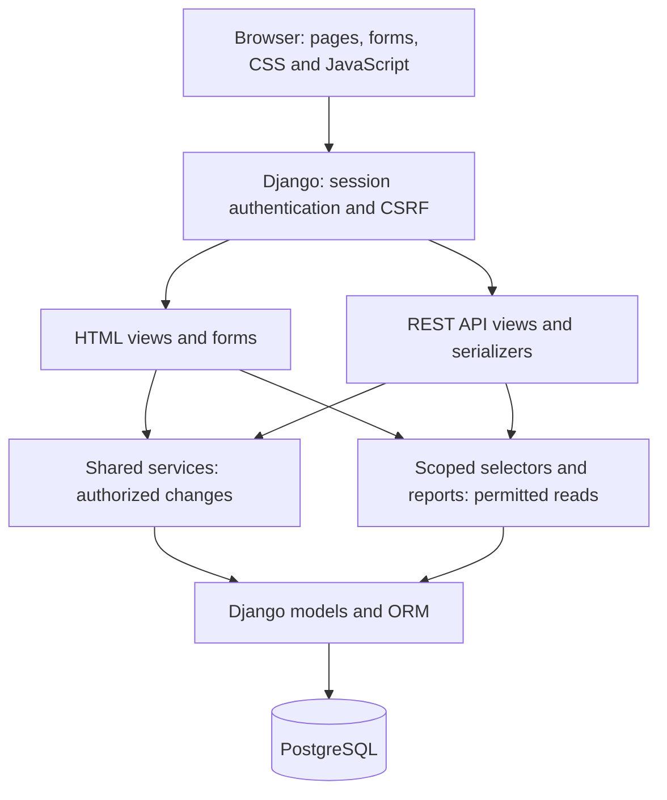

# Project & Resource Management System

A web application for managing employees, assigning project work and recording time.
Built as a technical assignment for Piiritu Innovations using Django, Django REST
Framework and PostgreSQL.

Managers create projects and assign tasks. Employees record their work and complete
their tasks. Admins manage accounts and make authorized corrections. Reports show
task progress and recorded hours from the database.

**Demo:** [Open the deployed application](https://project-resource-management-s1bi.onrender.com).
Request demo credentials privately from the project owner. Local setup below creates
your own database and sample accounts; it does not copy the hosted database.

## Contents

- [Features and roles](#features-and-roles)
- [Run it on your computer](#run-it-on-your-computer)
- [Try the complete workflow](#try-the-complete-workflow)
- [Architecture](#architecture)
- [Project structure](#project-structure)
- [Check database records](#check-database-records)
- [Run the tests](#run-the-tests)
- [Deployment](#deployment)
- [Troubleshooting](#troubleshooting)
- [Documentation and limitations](#documentation-and-limitations)

## Features and roles

| Role | What they can do |
| --- | --- |
| Admin | Create, edit and deactivate accounts; manage all projects; make explicit corrections to completed tasks and recorded time. |
| Project Manager | Create and manage their own projects, add employees, assign tasks and view project reports. |
| Employee | View membership projects, start and complete assigned tasks, and record/edit/delete their own eligible time entries. |

The desktop workspace includes account management, project teams, task filters,
**My tasks**, time-entry forms, confirmation pages and reports. The complete workflow
is available through the application, without using Django Admin.

- Tasks move **To do → In progress → Completed**, one step at a time.
- New assignments require an active Employee who belongs to the project.
- Completed work is read-only for Managers and Employees. Admin corrections preserve completed status and original time attribution.
- Time is entered as whole **Hours** and additional **Minutes**: `1 hour + 30 minutes = 90 minutes` in the database. Each entry totals 1 minute–24 hours; future work dates are rejected.
- Deactivation blocks access while preserving history. A member's unfinished tasks must be reassigned or completed before removal.
- Completion is completed tasks ÷ total tasks; empty projects display 0%.

Permissions are checked on the server for both pages and APIs, including direct requests.

## Run it on your computer

Follow these steps once. Commands run in a **terminal**: on macOS use Terminal;
on Windows use PowerShell; in VS Code choose **Terminal → New Terminal**.
Run each block in order and wait for it to finish before continuing.

### 1. Install the required tools

| Tool | Purpose | Installation |
| --- | --- | --- |
| Git | Downloads the source code. | [Git downloads](https://git-scm.com/downloads/) |
| uv | Installs Python and the project's libraries. | [uv installation guide](https://docs.astral.sh/uv/getting-started/installation/) |
| PostgreSQL | Stores accounts, projects, tasks and time entries. | [PostgreSQL downloads](https://www.postgresql.org/download/) |

This setup uses Python **3.12** through uv. Local database verification used
PostgreSQL **17**. Note your PostgreSQL administrator username/password during
installation and keep its server running. The usual Windows installer administrator
is `postgres`; macOS installations may use your computer's username. VS Code is optional.

Check that installation succeeded:

```bash
git --version
uv --version
psql --version
```

If a command is not found, finish that installation and reopen the terminal.

### 2. Download the project and install its libraries

```bash
git clone https://github.com/samarthya-06/project-resource-management.git
cd project-resource-management
uv python install 3.12
uv sync --locked
```

If you already have the project, open its folder instead of cloning it again.
You are in the correct folder when you can see `manage.py` and `README.md`.
`uv sync --locked` installs the versions in `uv.lock` into `.venv`.
You do not need to activate `.venv` when using `uv run`.

### 3. Create your private configuration

For a **new setup**, copy the example file:

```bash
cp .env.example .env
```

Do not replace an existing `.env`: it may contain working credentials.
Open `.env` in your editor. Generate an application secret:

```bash
uv run python -c "from django.core.management.utils import get_random_secret_key; print(get_random_secret_key())"
```

Copy its output into `DJANGO_SECRET_KEY`. Generate separate passwords for the
database and sample accounts by running this command twice:

```bash
uv run python -c "import secrets; print(secrets.token_urlsafe(24))"
```

Your local `.env` should contain these settings. Replace the three `paste-...`
values with your generated values; keep the setting names:

```dotenv
DJANGO_SECRET_KEY=paste-generated-application-secret
DJANGO_DEBUG=True
DJANGO_ALLOWED_HOSTS=localhost,127.0.0.1
DB_NAME=project_resource
DB_USER=project_user
DB_PASSWORD=paste-generated-database-password
DB_HOST=127.0.0.1
DB_PORT=5432
DEMO_PASSWORD=paste-generated-demo-password
```

Save the file. `.env` is private and ignored by Git. Debug mode is for local HTTP
development; deployment uses `False`. Leave `DATABASE_URL` unset for local setup:
if present, it takes precedence over the `DB_...` settings. Exported environment
variables also take precedence over values in `.env`.

### 4. Create a PostgreSQL database

Connect with your PostgreSQL **administrator** account. Replace
`YOUR_POSTGRES_ADMIN` with the username from installation:

```bash
psql -h 127.0.0.1 -U YOUR_POSTGRES_ADMIN -d postgres
```

Enter its password when prompted. Nothing appears while typing; that is normal.
At the `postgres=#` prompt, run:

```sql
CREATE ROLE project_user LOGIN CREATEDB PASSWORD 'paste-generated-database-password';
CREATE DATABASE project_resource OWNER project_user;
```

Replace only `paste-generated-database-password` with the exact `DB_PASSWORD`
from `.env`; keep the single quotes. `project_user` is a database account, separate
from website logins. `CREATEDB` allows local tests to create their own database;
this role is not a PostgreSQL superuser.

Exit PostgreSQL to return to the normal terminal:

```text
\q
```

If the role/database already exists, reuse the intended database and matching
credentials. Do not delete it to repeat setup.

### 5. Create the tables and sample data

```bash
uv run python manage.py migrate
uv run python manage.py seed_demo
```

`migrate` creates the tables. `seed_demo` adds sample accounts and projects for
practice. It requires debug mode and a strong `DEMO_PASSWORD`. Repeating it preserves
existing passwords and existing demo project contents; it does not undo your edits.

For an empty installation, skip `seed_demo` and run
`uv run python manage.py createsuperuser` to create the first Admin account.

### 6. Start the application and sign in

```bash
uv run python manage.py runserver
```

Keep this terminal open. Visit [http://127.0.0.1:8000/login/](http://127.0.0.1:8000/login/).
Use one of these sample accounts with the **DEMO_PASSWORD you chose in `.env`**:

| Login identifier | Role | Sample state |
| --- | --- | --- |
| `admin@demo.local` | Admin | Active |
| `neha@demo.local` | Project Manager | Owns three projects |
| `arjun@demo.local` | Project Manager | Owns a separate project |
| `asha@demo.local` | Employee | Assigned work and recorded time |
| `ravi@demo.local` | Employee | Assigned work and recorded time |
| `dev@demo.local` | Employee | Active, initially unassigned |
| `meera@demo.local` | Employee | Inactive; sign-in is intentionally denied |

**Login identifier** is the account's unique username. Sample usernames resemble
email addresses; contact email is a separate optional field. Identifiers are
case-sensitive. Sample accounts skip the initial-password-change step; newly created
or password-reset accounts must change their initial password before using the workspace.

Fresh sample data contains 4 projects, 12 tasks and 7 time entries. Neha's projects
have 24 recorded hours; Asha's own work totals 13 hours.

### Start it again later

Start PostgreSQL, open a terminal in this project folder and run
`uv run python manage.py runserver`. Press **Ctrl+C** to stop the web server.
Saved records remain in PostgreSQL after refreshing or restarting. After updating
the source, run `uv sync --locked` and `uv run python manage.py migrate` before restarting.

## Try the complete workflow

1. Sign in as **Admin** to explore Employees and create any additional accounts.
2. Sign in as **Neha**. Create a project, open **Team** and add Asha.
3. Open **Tasks**, create a task and assign it to Asha.
4. Sign in as **Asha**. Open **My tasks**, choose the task and select **Start task**.
5. Log a work date, `1` Hour, `30` Minutes and a note. Check the saved entry; try editing it.
6. Select **Mark completed**, read the confirmation and confirm. Record remaining time first.
7. Sign in as **Neha** and open the project's **Report** to check completion and hours.

Completed work should show a read-only explanation. Use separate browser profiles/private
windows when comparing roles, or sign out before switching accounts.

## Architecture

The browser displays pages generated by Django. Page forms and REST API requests
use the same business operations, keeping permissions and validation consistent.
PostgreSQL stores the records; refreshing a page reads those saved records again.



**Log time**, for example: the form validates Hours/Minutes → the view calls a
shared service → the service checks the employee, assignment and current task status
→ the model saves total minutes → the refreshed page shows the entry. Transactions
and row locks protect competing completion, reassignment and time changes.

The five main records are **User**, **Project**, **ProjectMembership**, **Task** and
**TimeEntry**. Membership links an employee to a project; a task has an assignee;
time retains its original contributor. See [architecture and relationships](docs/architecture.md)
for a data diagram and a code-reading guide. Diagrams render on GitHub.

## Project structure

| Location | What it contains |
| --- | --- |
| `config/` | Settings, main URLs and deployment entry points. |
| `accounts/` | Users, roles, login/password handling and account management. |
| `projects/` | Projects, membership, tasks, time, permissions and reports. |
| `templates/` | HTML pages and shared form/layout components. |
| `static/` | CSS, small JavaScript helpers and licensed IBM Plex Sans fonts. |
| `tests/` | Automated model, workflow, API, security and browser checks. |
| `scripts/` | Deployment scripts and browser/SQL verification helpers. |
| `sql/` | Read-only project-report queries. |
| `docs/` | Schema, APIs, business rules, test results and limitations. |
| `manage.py` | Entry point for Django commands such as migrate and runserver. |
| `.env.example` | Configuration template; private values go in ignored `.env`. |
| `pyproject.toml` / `uv.lock` | Required libraries and their reproducible versions. |

The stack uses Python 3.12, Django 5.2, Django REST Framework, PostgreSQL,
server-rendered HTML/CSS and plain JavaScript. Gunicorn and WhiteNoise serve the
deployed app and static assets. Exact library versions are in `uv.lock`.

## Check database records

Changes are saved in the database configured by `.env` or `DATABASE_URL`.
A fresh clone does not include another machine's database records.

```bash
uv run python manage.py dbshell
```

At the database prompt, run these read-only queries:

```sql
SELECT id, username, role, is_active FROM accounts_user ORDER BY id DESC LIMIT 10;
SELECT id, name, manager_id FROM projects_project ORDER BY id DESC LIMIT 10;
SELECT id, title, status, assignee_id FROM projects_task ORDER BY id DESC LIMIT 10;
SELECT id, task_id, employee_id, work_date, minutes FROM projects_timeentry ORDER BY id DESC LIMIT 10;
```

Exit with `\q`. [sql/project_reports.sql](sql/project_reports.sql) contains full
project/status/hour queries. Compare SQL with the app's reports without changing records:

```bash
uv run python manage.py shell -c "from scripts.verify_project_reports import verify; print(verify())"
```

This requires an active, password-ready Admin. A successful comparison includes
`'result': 'MATCH'` in the output dictionary.

## Run the tests

Install Chromium once, then run checks from the project folder:

```bash
uv run playwright install chromium
uv run python manage.py check
uv run python manage.py makemigrations --check --dry-run
uv run pytest
uv run ruff check .
uv run ruff format --check accounts config projects tests scripts
```

Tests use a separate PostgreSQL database (`test_<DB_NAME>`) and fixture accounts;
the local role needs `CREATEDB`. Browser tests start their own server. On Linux,
system dependencies may require `uv run playwright install --with-deps chromium`.
The test suite runs `collectstatic` once into a temporary directory automatically,
so production-template and static-file tests also work on a fresh clone. Deployment
still runs its own asset build; tests do not overwrite local collected files.

Latest recorded local verification, **9 October 2026**:

| Check | Recorded result |
| --- | --- |
| Existing PostgreSQL regression suite | 284 passed. |
| Additional 40-case browser/HTTP review | 40 executable tests passed; all 40 recorded cases PASS, including Overview visibility after Start task. |
| SQL versus application reports | MATCH for 4 projects and 4 contributor pairs. |
| Django, migration drift, Ruff lint/format | Passed. |
| Fresh-checkout setup smoke check | Locked install, migrations, sample seed, database reads, SQL comparison and Admin login/Overview passed. |

The original 284 and 40 tests were executed separately. After fixing the missing
static-asset test prerequisite, the full suite passed **324 tests in one invocation**.
See [testing and results](docs/testing.md) for category coverage, SQL comparisons,
the resolved setup defect, manual execution instructions and remaining verification.

The [forty-case workbook](docs/qa40-results.xlsx), [detailed results CSV](docs/qa40-results.csv)
and [evidence index](docs/evidence/qa40/index.md) contain the recorded outcomes.
[Manual-test-cases.csv](docs/manual-test-cases.csv) records the separate forty-case
manual run, confirmed as passing by Samarthya Jambavalikar on 9 October 2026.

Run only the additional review with `uv run pytest tests/test_submission_review.py -q`.
With `QA40_EVIDENCE=1` set in your terminal environment, it replaces JSON/screenshots;
it does not update the CSV/workbook automatically. Existing browser tests also write
screenshots; preserve needed evidence before rerunning. The optional
`scripts/verify_auth_browser.py` smoke script uses a running development server and
unchanged seeded credentials from `DEMO_PASSWORD`:

```bash
uv run python scripts/verify_auth_browser.py
```

## Deployment

The demo uses a Render Python web service and separate PostgreSQL database.
Follow [the deployment guide](docs/render-deployment.md) for secrets, TLS and explicit seeding.

| Render setting | Value |
| --- | --- |
| Branch | `main` |
| Build command | `bash scripts/render-build.sh` |
| Start command | `bash scripts/render-start.sh` |
| Production debug | `DJANGO_DEBUG=False` |

Build installs locked libraries and collects static files. Startup applies migrations
before Gunicorn starts; it does not seed accounts automatically. After pushing an
approved change, use **Manual Deploy → Deploy latest commit** in Render, or configure
automatic deploys. Check logs and repeat important workflows on the hosted site.

## Troubleshooting

| Problem | What to check |
| --- | --- |
| `uv`, `git` or `psql` is not found | Finish installation, ensure the tool is on PATH, then reopen the terminal. PostgreSQL's installation `bin` folder contains `psql`. |
| Database connection refused | Start PostgreSQL; verify `DB_HOST` and `DB_PORT`. |
| Database password authentication failed | Match `DB_USER`/`DB_PASSWORD` to step 4. Check whether `DATABASE_URL` overrides them. |
| Missing secret or example-value error | Save `.env` with generated values instead of placeholders. |
| `seed_demo` requests a strong password | Set a generated `DEMO_PASSWORD`; local debug must be `True`. Existing passwords are preserved on repeat runs. |
| Sign-in rejected | Use the exact identifier/password for this database. Meera is inactive; hosted credentials may differ. |
| Sent to Change password | New/reset accounts must change their initial password before workspace access. |
| Local HTTP sign-in does not persist | Use local `DJANGO_DEBUG=True`; debug-off cookies require HTTPS. |
| Port 8000 is in use | Stop the previous server or use `uv run python manage.py runserver 8001` and open port 8001. |
| Tests cannot create a database | Grant the local role `CREATEDB`; do not target a hosted production database. |
| Browser executable is missing | Run `uv run playwright install chromium`. |
| Records remain after refresh | Expected: PostgreSQL preserves saved work. Refresh is not a reset. |

## Documentation and limitations

The assignment's submission files are collected here:

| Requirement | File |
| --- | --- |
| Source code / Git repository | This repository, including migrations and locked dependencies. |
| Database/schema information | [Schema](docs/schema.md), with fields, relationships, constraints and indexes. |
| Setup instructions | This README. |
| API documentation | [REST API](docs/api.md), including session/CSRF examples and permissions. |
| Manual test cases | [Forty completed manual cases](docs/manual-test-cases.csv); [testing guide and recorded results](docs/testing.md). |
| SQL queries | [Project reports](sql/project_reports.sql). |
| Known limitations | [Scope and verification gaps](docs/known-limitations.md). |

Three supporting guides explain [architecture](docs/architecture.md),
[business rules](docs/business-rules.md) and [Render deployment](docs/render-deployment.md).
The desktop workflow is implemented. Manual time entry, missing login rate limiting
and the additional accessibility/hosted verification gaps are documented limitations.
