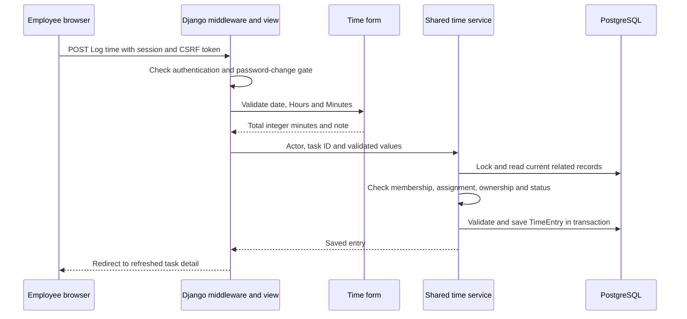
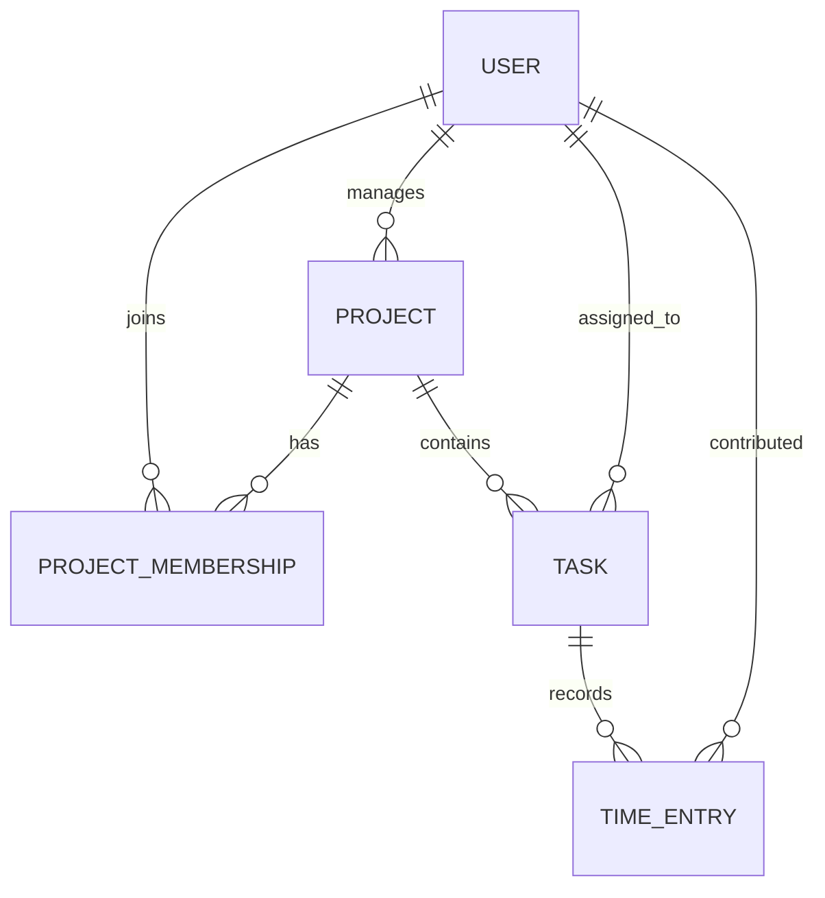

# Architecture and code-reading guide

This is one Django application with two feature packages: `accounts` and `projects`.
It serves HTML pages and a session-authenticated REST API. PostgreSQL is the shared
persistent database. There is no separate frontend server or background worker.

## A request from click to database

The diagram shows a successful request. Invalid input returns a form with errors;
stale completion/reassignment rejects the change and preserves useful input. API
requests validate JSON through serializers and call the same mutation services.
Selectors scope reads before filtering/pagination; reports use that authorized scope.

## Data relationships

| Record | Meaning |
| --- | --- |
| User | A login account with Admin, Project Manager or Employee role. |
| Project | Work owned by one Manager, with a name, description and dates. |
| ProjectMembership | One Employee's membership in one project; duplicate membership is prohibited. |
| Task | Work within a fixed project, assigned to an Employee member, with one of three statuses. |
| TimeEntry | A work date, integer minutes and optional note tied to a task and original contributor. |

Role/activity restrictions are checked by application operations and model validation;
the diagram represents relationships, not every authorization rule. A task references
its assignee directly rather than referencing a membership row. A time entry references
its original contributor separately from the current task assignee. This is why
reassignment never transfers historical hours to someone else.

## Where each responsibility lives

| Responsibility | Files to read |
| --- | --- |
| Environment, database, middleware and deployment | `config/settings.py`, `config/urls.py`, `scripts/render-build.sh`, `scripts/render-start.sh` |
| User roles and login/password handling | `accounts/models.py`, `accounts/views.py`, `accounts/middleware.py` |
| Account forms, UI and authorized operations | `accounts/workspace_forms.py`, `accounts/workspace_views.py`, `accounts/services.py` |
| Project/team HTML pages | `projects/views.py`, `projects/forms.py` |
| Task/time HTML pages | `projects/task_views.py`, `projects/forms.py`, `projects/display.py` |
| REST endpoints and JSON validation | `projects/api.py`, `projects/serializers.py`, `projects/api_urls.py`, `accounts/api.py`, `accounts/serializers.py` |
| Authorized mutations | `projects/services.py`, `accounts/services.py` |
| Scoped reads and report calculations | `projects/selectors.py`, `accounts/selectors.py`, `projects/reports.py` |
| Persistent records and validation | `projects/models.py`, `accounts/models.py`, each package's `migrations/` |
| Pages and presentation | `templates/workspace/`, `templates/accounts/`, `static/` |

For a first code walkthrough, read `projects/models.py` to understand the records,
then `projects/forms.py`, `projects/task_views.py` and the time operations in
`projects/services.py`. Follow the corresponding template in `templates/workspace/`.
Finally, read the task/time tests to see successful requests and rejected ones.

## Permissions and consistency

HTML views and API endpoints authenticate the actor, scope objects and call shared
services for mutations. Services whitelist editable fields and enforce role,
ownership, task state and current relationships. Models validate stored data;
PostgreSQL constraints protect row invariants such as valid statuses, bounded minutes,
date ordering and unique membership. Hidden buttons are not authorization.

Transactions and row locks serialize supported competing changes. Application
services use the documented User-before-Project lock order, then affected entity
records; model writes lock the containing project before the updated entity.
See [business rules](business-rules.md) and [schema](schema.md) for exact details.
Bulk ORM/raw SQL writes bypass some application validation and are not a supported
route for application mutations.

Passwords are hashed by Django. Login uses sessions; mutations require CSRF protection.
Employees see only their own detailed time notes. Managers see their own projects,
and completed work is locked for Managers/Employees. Explicit Admin corrections keep
the completed status and fixed time-entry identity.

## Reports and hosting

Reports count tasks separately from summing time to avoid counting hours multiple
times when joining related tables. Contributor totals use `TimeEntry.employee`,
not `Task.assignee`. [Report SQL](../sql/project_reports.sql) provides read-only
queries; `scripts/verify_project_reports.py` compares them with application reports.

On Render, Gunicorn runs Django and WhiteNoise serves collected static assets.
The hosted PostgreSQL database is separate from a reviewer's local database. Build
and startup scripts install locked dependencies, collect assets and apply migrations;
sample seeding is an explicit operation. See [deployment](render-deployment.md).
